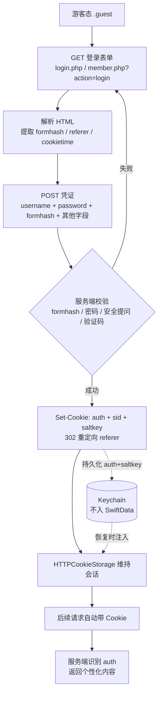

# Discuz 7.2 登录流程技术探查（Sprint 5A）

> 探查性质：**仅架构验证，未提交任何凭证、未实现登录功能**。
> 目标：确认 4D4Y Discuz! 7.2 的登录流程形态，为未来（经用户明确授权的）登录阶段建立参考基线。
> 红线：不实现密码提交 / 自动登录 / 发帖 / 回复；不修改 `HTTPClient` / `Parser` / `ForumRepository` / Phase 1.5 测试。

---

## 0. 结论摘要

- 论坛基址：`https://www.4d4y.com/forum/`（`Discuz! 7.2`，前端 `nginx/1.20.1`，`GBK` 编码，定制 wap 模板）。
- **关键发现**：标准 `login.php` 在域名根与 `/forum/` 下均返回 **404**；`register.php` 同样 **404**；`member.php` 存在，但对 `action=login` / `action=logout` 均返回「未定义操作」。
- 即 **4D4Y 的标准 Web 登录入口在游客态公开形态下不可达 / 已被定制收敛**，无法在游客态直接定位真实登录表单。这是本次探查最重要的架构结论，意味着未来登录实现不能依赖教科书式的 `login.php` POST，必须先逆向定位真实入口。
- 因此本文同时给出 **Discuz 7.2 标准登录流程（参考架构）** 与 **4D4Y 特异性差距** 两部分，二者需在未来登录阶段合并复核。

---

## 1. 端点地址验证（实证结果）

| 探测 URL | HTTP 结果 | 解读 |
|---|---|---|
| `https://www.4d4y.com/forum/login.php` | 404 | 标准登录脚本不存在 / 已改名 |
| `https://www.4d4y.com/login.php` | 404 | 域名根目录同样不存在 |
| `https://www.4d4y.com/forum/register.php` | 404 | 注册脚本不存在 |
| `https://www.4d4y.com/forum/member.php` | 200（无 action） | 脚本存在，返回「未定义操作」 |
| `https://www.4d4y.com/forum/member.php?action=login` | 「未定义操作」 | `login` 动作未开放 |
| `https://www.4d4y.com/forum/member.php?action=logout` | 「未定义操作」 | `logout` 动作未开放 |
| `https://www.4d4y.com/forum/member.php?action=login&loginsubmit=yes` | 「未定义操作」 | 提交形态同样被拒 |
| `https://www.4d4y.com/forum/logging.php` | 「未定义操作」 | 无独立脚本，被 `member.php` 兜底 |

> 判定：4D4Y 的 `member.php` 动作白名单已被定制（标准 `login` / `logout` 不在其中），且标准 `login.php` 已移除。真实登录入口可能改名、置于 Cloudflare 保护区，或仅存在于桌面完整模板（当前 wap 模板不在首页暴露登录链接）。

---

## 2. 标准 Discuz 7.2 登录流程（参考架构）

> 以下为 Discuz! 7.2 通用登录机制，作为本客户端未来登录实现的**参考基线**。4D4Y 已定制，实际端点与字段须在登录阶段重新抓取复核。

### 2.1 GET 流程（获取登录表单）

```
GET <base>/login.php            （常规 Discuz 7.2）
  或 member.php?action=login    （部分安装）
→ 200 HTML 登录表单
```

### 2.2 登录表单字段

| 字段 | 类型 | 必填 | 说明 |
|---|---|---|---|
| `formhash` | hidden | 是 | 防 CSRF 令牌，由 `authkey + uid + 时间戳` 派生；POST 须原样回传，服务端校验。 |
| `referer` | hidden | 是 | 登录后跳转地址（常为当前页或首页）。 |
| `loginfield` | hidden / select | 是 | 登录方式：`username` 或 `email`，默认 `username`。 |
| `username` | text | 是 | 用户名或邮箱。 |
| `password` | password | 是 | 密码（明文提交，依赖 HTTPS 传输）。 |
| `questionid` | select | 否 | 安全提问编号：`0`=无，`1–8` 为预设提问。 |
| `answer` | text | 条件 | `questionid > 0` 时必填。 |
| `cookietime` | hidden / select | 否 | Cookie 有效期（秒）：`0`=会话级，`2592000`=30 天等。 |
| `seccodeverify` | text | 条件 | 验证码（若后台开启 `seccode`）；通常伴随 `seccodehidden` 隐藏域。 |
| `loginsubmit` | submit | 是 | 提交标记（值如 `true` / `登录`）。 |

### 2.3 POST 流程（提交凭证）

```
POST <base>/login.php?action=login&loginsubmit=yes
     （或 member.php?action=login&loginsubmit=yes）
Content-Type: application/x-www-form-urlencoded
Body: formhash + referer + loginfield + username + password
      + [questionid + answer] + [cookietime] + [seccodeverify + seccodehidden]
      并随请求携带既有 Cookie（如 sid）
```

服务端校验 `formhash` → 用户名 / 密码 → 安全提问 → 验证码（若开启）：
- 成功：写入 `sessions` 表（`sid`）+ 下发 `Set-Cookie` + **302 重定向**至 `referer` 或首页。
- 失败：返回错误提示（常带 `formhash` 刷新）。

### 2.4 Cookie 返回

| Cookie | 含义 | 客户端处理 |
|---|---|---|
| `auth` | 主认证 Cookie，`authcode(uid\tpassword\texpiry\tec_salt, ENCODE, discuz_auth_key)` 加密；**持久凭证**。 | **必须持久化到 Keychain**（"记住我"）。 |
| `sid` | 会话 ID（游客或 Cookie 禁用时）。 | 由 `HTTPCookieStorage` 会话级维持；可选持久化。 |
| `saltkey` | 客户端随机盐，用于派生 `auth` 的加密 key。 | 与 `auth` 一并持久化。 |
| `cookietime` | Cookie 过期时间戳。 | 用于续期判断。 |
| `lastvisit` / `lastactivity` | 活动时间戳。 | 可选。 |

### 2.5 Session 保存方式（客户端策略）

- 服务端：会话记录于 `sessions` 表（按 `sid`），或通过 `auth` Cookie 无状态识别。
- iOS 客户端（与 Phase 2 设计决策一致）：
  1. 网络层用 `URLSession` 默认 `HTTPCookieStorage` 维持会话 Cookie。
  2. **持久凭证（`auth` + `saltkey`）存入 Keychain，绝不进入 SwiftData**（凭据不属于业务数据模型）。
  3. `UserSession` 仅作内存态表示；恢复时从 Keychain 读取 `auth` 注入 `HTTPCookieStorage`。

---

## 3. 请求流程图



---

## 4. 4D4Y 特异性差距（待登录阶段复核）

1. **标准 `login.php` 不可达** → 真实端点可能改名、移至 Cloudflare 保护区，或仅存在于桌面完整模板（wap 模板不暴露登录入口）。
2. **`member.php` 动作白名单被定制** → 标准 `login` / `logout` 未开放，需审查站点模板或抓取桌面版首页以定位真实入口。
3. **验证码（seccode）策略未知** → 登录实现须支持 seccode 获取与回传（含 `seccodehidden`）。
4. **Cloudflare 挑战** → 此前 `index.php` 曾被 403，登录域可能施加额外挑战，需在登录阶段实测。

---

## 5. 红线与范围（Sprint 5A）

- **不实现**：密码提交、自动登录、发帖、回复、私信、收藏、通知。
- **不修改**：`HTTPClient` / `Parser` / `ForumRepository` / Phase 1.5 测试。
- **仅文档化 + 框架预留**；本次探查未向服务器发送任何凭证。

---

## 6. 工程预留（Core/Authentication）

| 文件 | 状态 | 说明 |
|---|---|---|
| `AuthenticationState` | 预留 | `.guest`（当前唯一）/ `.authenticated(UserSession)`（预留，未进入）。 |
| `UserSession` | 预留 | 仅数据载体（`uid` / `username` / `loginTime`），未构造实例；**不含任何凭据字段**（凭据存 Keychain）。 |
| `SessionManager` | 预留 | `.guest` 默认态，预留 `signIn` / `signOut`（注释，未实现）；明确禁止伪造 `.authenticated`。 |
| `LoginFlowReference` | **新增（参考元数据）** | 登录流程参考：端点候选 + 字段名常量 + Cookie 名。仅供未来实现消费，**本构建不发起任何请求**。 |

---

## 7. 未来优化记录

1. **`ReadHistory.scrollOffset`**：未来 `ReadHistory` 增加 `var scrollOffset: Double?`，记录帖子详情滚动位置，支撑「继续阅读」精确滚动定位（当前仅记录 `lastReadPostID` 末楼锚点，未追踪真实滚动位置）。
2. **`ForumURLResolver`**：未来将 `PostContent.resolveURL(...)` 的图片地址解析逻辑抽离为独立 `ForumURLResolver`（统一相对 / 绝对 URL 补全、CDN 域名校准），供 `ThreadList` / `ThreadDetail` 复用。

---

## 8. 待 macOS / Xcode 验证

- 本次新增 `LoginFlowReference.swift`（纯元数据，无网络代码），由 XcodeGen 目录级 `sources` 自动纳入构建，需在 Mac 上确认编译通过。
- 其余为文档与注释，无编译风险。
