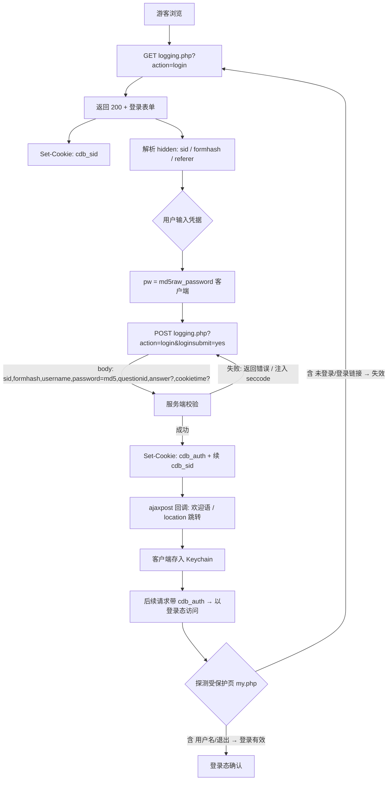

# 4D4Y Discuz! 7.2 真实登录流程验证（Sprint 5B）

> 本文档是 **Sprint 5A** `LoginFlow.md` 的**实证修正版**。Sprint 5A 基于"标准 Discuz 7.2 教程"推断，
> 且当时未能定位真实登录入口（`login.php` / `member.php?action=login` 均 404）。
> 本 Sprint 5B 通过**真实抓取** `https://www.4d4y.com/forum/logging.php?action=login` 验证真实链路。
>
> **红线**：本文档与配套 `LoginFlowReference.swift` 仅做架构预留与取证，**不实现**登录按钮、密码提交、自动登录、发帖、回复。

---

## 0. 与 Sprint 5A 的关键差异（已实证修正）

| 项目 | Sprint 5A（推断） | Sprint 5B（真实抓取） |
|---|---|---|
| 登录入口 | `login.php` / `member.php?action=login`（均 404） | **`logging.php?action=login`** ✅ 实测 200 |
| Cookie 前缀 | 未确认 | **`cdb_`** ✅ 实测 `Set-Cookie: cdb_sid=...` |
| `saltkey` 独立 Cookie | 按 Discuz X 假设存在 | **Discuz 7.2 无独立 saltkey Cookie**；saltkey 内嵌于 `cdb_auth` 载荷 |
| 密码提交形态 | 明文 POST | **客户端 `pwmd5()` 先 MD5** 再提交（收 `md5(rawpw)`） |
| 验证码 | 未提及 | **条件出现**：默认无 `seccode` 输入，`seccodelayer` 占位留空，失败多次后服务端才注入 |

---

## 1. 登录页面真实 HTML 分析

**请求**：`GET https://www.4d4y.com/forum/logging.php?action=login`
**实测响应**：HTTP `200`，字节数 `10955`，编码 `GBK`（meta 声明 `gb18030` 解码正常）。
**GET 阶段 `Set-Cookie`**：`cdb_sid=gG6bG0`（会话 Cookie，前缀 `cdb_`）。

页面含**两个表单**：

- `loginform`（id=`loginform`，class=`s_clear`）—— 登录主表单
- `lostpwform`（id=`lostpwform`）—— 找回密码（`member.php?action=lostpasswd&lostpwsubmit=yes&infloat=yes`），与登录无关

### 1.1 登录主表单原始结构（已取证，截取自真实响应）

```html
<form method="post" name="login" id="loginform" class="s_clear"
      onsubmit="pwmd5('password3');pwdclear = 1;ajaxpost('loginform', 'returnmessage', 'returnmessage', 'onerror');return false;"
      action="logging.php?action=login&amp;loginsubmit=yes">
  <input type="hidden" name="sid" value="gG6bG0" />
  <input type="hidden" name="formhash" value="ddaf03e6" />
  <input type="hidden" name="referer" value="" />
  <select name="loginfield" id="loginfield">
    <option value="username">用户名</option>
    <option value="uid">UID</option>
    <option value="email">Email</option>
  </select>
  <input type="text" name="username" autocomplete="off" size="36" class="txt" value="" />
  <input type="password" id="password3" name="password" size="36" class="txt" />
  <div id="seccodelayer"></div>
  <select id="questionid" name="questionid">
    <option value="0">安全提问</option>
    <option value="1">母亲的名字</option>
    ... <option value="7">驾驶执照的最后四位数字</option>
  </select>
  <input type="text" name="answer" id="answer" style="display:none" />
  <button class="submit" type="submit" name="loginsubmit" value="true">登录</button>
  <input type="checkbox" class="checkbox" name="cookietime" id="cookietime" value="2592000" />
</form>
```

### 1.2 表单字段逐项分析

| 字段 | 类型 | 默认/取证值 | 必填 | 说明 |
|---|---|---|---|---|
| `sid` | hidden | `gG6bG0` | 是 | 会话 ID，与 `cdb_sid` Cookie 一致，必须原样回传 |
| `formhash` | hidden | `ddaf03e6` | 是 | **CSRF / 防重放令牌**，每次 GET 重新生成，POST 必须带回 |
| `referer` | hidden | `""` | 否 | 登录后跳转地址，可填首页或来源页 URL |
| `loginfield` | select | `username` | 否 | 登录标识类型：`username`/`uid`/`email` |
| `username` | text | 空 | 是 | 用户名（或 UID / Email，取决于 `loginfield`） |
| `password` | password | 空 | 是 | **元素 id=`password3`**；提交前被 `pwmd5('password3')` 替换为 `md5(明文)` |
| `questionid` | select | `0` | 否 | 安全提问：0=无，1–7=各预设问题 |
| `answer` | text | 隐藏 | 否 | 仅当 `questionid>0` 时显示并必填（安全提问答案） |
| `cookietime` | checkbox | `2592000` | 否 | "记住登录状态"，勾选则持久化（`2592000`s = 30 天） |
| `loginsubmit` | submit(button) | `true` | 是 | 判定开关；同名的查询参数 `loginsubmit=yes` 已在 action 中 |

### 1.3 关键行为取证

- **`onsubmit="pwmd5('password3'); ... ajaxpost(...); return false;"`**
  - `pwmd5('password3')`：浏览器端 MD5 哈希，**把 `password3` 输入框的值原地替换为 `md5(原文)`**。服务端收到的是 MD5 值而非明文。
  - `ajaxpost(...)`：以 **AJAX（XMLHttpRequest）** 方式提交，成功/失败写入 `returnmessage` 容器，由 `onerror` 回调处理。
  - `return false`：阻止原生表单提交 —— 真实客户端需**自行复刻该 AJAX POST**（或直接 POST 到 action URL，Discuz 后端按 `$_POST['loginsubmit']` 处理，两种均可）。
- **`<div id="seccodelayer"></div>`** 为空：默认**无验证码输入**；该层为服务端按需注入 `seccode` 字段的占位（连续失败/风控时激活）。实现登录时必须**动态检测**该层是否含 `seccodeverify` 输入。

---

## 2. POST 参数表（来自真实 HTML，非教程推断）

**提交 URL**（action 绝对化）：
`https://www.4d4y.com/forum/logging.php?action=login&loginsubmit=yes`

**方法**：`POST`（表单 `method="post"`；编码 `application/x-www-form-urlencoded`）

**Body 参数**（按真实表单 name 原样）：

| 参数 | 来源 | 取值规则 | 备注 |
|---|---|---|---|
| `sid` | hidden | `GET 时的 cdb_sid 值` | 必带，防 CSRF 关联 |
| `formhash` | hidden | `GET 返回的 formhash` | **必带且须与本次会话一致** |
| `referer` | hidden | 空 或 回跳 URL | 可选 |
| `loginfield` | select | `username` / `uid` / `email` | 默认 `username` |
| `username` | text | 用户输入 | 必填 |
| `password` | password | **`md5(用户明文密码)`** | ⚠️ 须客户端先 MD5（复刻 `pwmd5`） |
| `questionid` | select | `0`–`7` | 默认 `0`（无提问） |
| `answer` | text | 安全提问答案 | 仅 `questionid>0` 时必填 |
| `cookietime` | checkbox | 勾选时 `2592000` | 否则不发送该键 |
| `loginsubmit` | submit | `true` | 登录判定开关 |

> **双重 `loginsubmit`**：action 查询串含 `loginsubmit=yes`，按钮 name=`loginsubmit` value=`true`。
> Discuz 后端 `if($loginsubmit)` 任一存在即触发；客户端任选其一（建议 body 带 `loginsubmit=true` 即可）。

> **MD5 实现要点（后续实现必须）**：Discuz 7.2 登录采用 **双 MD5 + salt** 机制。
> 客户端发送 `pw = md5(raw_password)`；服务端取该用户 `salt`，计算 `md5(pw . salt)` 与库中存储值比对。
> 即客户端**只需计算一次 `md5(rawpw)`**，无需 salt。Apple 平台可用 `CryptoKit Insecure.MD5` 或 `CommonCrypto CC_MD5`。

---

## 3. Cookie 表

### 3.1 实测（GET 登录页返回）

| Cookie | 值（样例） | 含义 | 生命周期 |
|---|---|---|---|
| `cdb_sid` | `gG6bG0` | 会话 ID（前缀 `cdb_` 来自 Discuz 表前缀配置） | 会话级（浏览器关闭失效，除非勾选 cookietime） |

### 3.2 预期（登录成功后由 `Set-Cookie` 下发，依据 Discuz 7.2 机制；本次未登录故未实测）

| Cookie | 含义 | 预期生命周期 | 持久化位置 |
|---|---|---|---|
| `cdb_auth` | **核心鉴权令牌**，载荷加密含 `uid` + `md5(pw+salt)` + `saltkey` + 过期时间 | 取决于 `cookietime`：勾选=30 天，否则会话级 | **Keychain**（非 SwiftData） |
| `cdb_sid` | 会话 ID，登录后延续 | 会话级 | Keychain / 内存 |

> **修正 Sprint 5A 的 `saltkey` 假设**：Discuz **7.2** 的 `saltkey` **不**作为独立 Cookie 下发，
> 而是内嵌在 `cdb_auth` 的加密载荷中（与 Discuz X 的 `cdb_sid`+`cdb_*` 分离式不同）。
> 因此客户端只需持久化 `cdb_auth`（及 `cdb_sid`），无需单独处理 `saltkey`。

### 3.3 持久化映射（架构决策，与 Phase 2 设计一致）

- `cdb_auth` → **Keychain**（kSecClassInternetPassword / 自定义 service），永不写入 SwiftData（SwiftData 仅存游客态本地数据：PinnedForum / BlockedUser / ReadHistory / VisitedForum / LocalSettings）。
- `cdb_sid` → 随 `cdb_auth` 一并保管，或仅留内存（会话级）。
- 退出登录：清除 Keychain 中 `cdb_auth` + `cdb_sid`，并请求 `member.php?action=logout&formhash=...`（需重新 GET 取 formhash）。

---

## 4. 登录流程图

### 4.1 Mermaid



### 4.2 阶段说明对应

- **第一阶段（GET）**：取证 `sid` / `formhash` / `cdb_sid`，已在 §1–§3.1 完成。
- **第二阶段（POST）**：参数表见 §2，MD5 与 ajaxpost 复刻见 §1.3。
- **第三阶段（Cookie）**：见 §3，`cdb_auth` 持久化到 Keychain。
- **第四阶段（状态判断）**：见 §5，以"受保护页内容标记"判定。

---

## 5. 登录状态判断（第四阶段实证）

**负向探测**：以游客态（仅持 `cdb_sid`）请求 `https://www.4d4y.com/forum/my.php`（用户中心）。
**实测结果**：HTTP `200`，**无 3xx 重定向**，`Location` 头为空；正文含标记 `未登录` / `登录` / `logging.php` / `register`。

**结论**：
- 4D4Y 的 wap 模板对用户中心**不强制重定向**，而是**内联渲染游客态**（显示"未登录"与登录入口）。
- 因此"登录成功"的判定应基于**内容标记**，而非依赖重定向：
  - **正向信号**：响应中出现鉴权后专属内容（`退出` 链接、`member.php?action=logout`、用户名展示、"欢迎回来"等）。
  - **负向信号**：仍含 `未登录` / `登录` 入口 → 会话无效。
- **更稳健做法**：以 **`cdb_auth` Cookie 是否存在**作为主信号；再任选一个"游客必被拒/必重定向"的接口做二次校验（需在未来登录实现时实测定位此类接口 —— `my.php` 不适用，因它 200 返回游客态）。

> 注：本阶段**未**发起任何带凭据的请求，未伪造会话；仅以游客态观测"未登录"标记以推导判定逻辑。

---

## 6. 后续实现建议（Sprint 6+ 登录功能）

1. **入口与防重放**：GET `logging.php?action=login` 取 `formhash` + `sid` + `cdb_sid`；每次登录会话必须重新获取 `formhash`（有有效期）。
2. **密码 MD5**：客户端用 `CryptoKit/Insecure.MD5` 计算 `md5(raw_password)`，填入 `password` 字段（复刻 `pwmd5`），**绝不发送明文**。
3. **提交方式**：复刻 `ajaxpost` 的 `x-www-form-urlencoded` POST；或简化为原生 POST 到 action URL（后端按 `loginsubmit` 判定）。建议先做原生 POST，验证通后再做 AJAX 体验。
4. **动态验证码**：提交前检测 `#seccodelayer` 是否注入 `seccodeverify`；若有，需先 GET 验证码图片（`misc.php?action=seccode&...`）并让用户填写 —— 这是**最大不确定项**，需单独验证 seccode 获取/校验链路。
5. **Cookie 持久化**：登录成功后把 `cdb_auth`（+`cdb_sid`）写入 **Keychain**；`HTTPClient` 增加"从 Keychain 注入 Cookie"分支（游客态不注入）。
6. **会话注入**：`HTTPClient` 在登录态下对所有 `forumdisplay.php` / `viewthread.php` 等请求自动附带 `cdb_auth`，实现"登录态浏览"。
7. **退出**：GET 取 `formhash` → POST/GET `member.php?action=logout&formhash=...` → 清 Keychain。
8. **状态校验**：持有 `cdb_auth` 即视为已登录；UI 据 `AuthenticationState` 在 `.guest` / `.authenticated` 间切换（当前框架仅 `.guest`，预留 `.authenticated`）。
9. **安全提问**：`questionid>0` 时须收集 `answer`，否则服务端拒绝。
10. **合规边界**：本客户端为第三方只读增强，**不存储密码明文**、**不实现自动登录**、**不绕过 Cloudflare/验证码风控**（验证码仅在用户主动输入时提交）。

---

## 7. 红线合规声明

- **未实现**：登录按钮、密码输入提交、自动登录、发帖、回复、私信、收藏、通知。
- **未修改**：`HTTPClient` / `Parser` / `ForumRepository` / Phase 1.5 测试。
- **取证范围**：仅 `GET` 登录页 + 游客态探测 `my.php`；**未发起任何带凭据的 POST**，未伪造会话。
- 配套 `LoginFlowReference.swift` 为 `REFERENCE ONLY` 元数据，**本构建不发起请求**。

---

## 8. Sprint 6 实现状态（最小可用登录）

本文档描述的链路已在 Sprint 6 落地实现，关键落点：

- `Core/Authentication/LoginRepository.swift`：按本文档流程 `GET → 解析 hidden → pwmd5 → POST → 捕获 cdb_auth → my.php 校验`；**复用** `HTTPClient`（其 `send` 原生支持 POST、`HTTPCookieStorage.shared` 管 Cookie），未修改它。
- `Core/Authentication/KeychainStore.swift`：仅持久化 `cdb_auth` 值与会话快照（用户名/uid），**不存明文密码**。
- `Core/Authentication/SessionManager.swift`：`login` / `logout` / `restore`（启动乐观恢复，把 Keychain 令牌注入 `HTTPCookieStorage.shared`）。
- `Features/Account/LoginView.swift` + `Features/Profile/ProfileView.swift`：登录页与"我的"Tab 的登录/登出入口。
- **验证码**：若服务端注入 `seccodeverify`，`LoginRepository` 返回 `.captchaRequired` 明确报错，**不绕过**（符合本文档第 6 条合规边界）。
- 仍**未实现**：自动登录、发帖、回复、私信、收藏、消息、图片上传。
